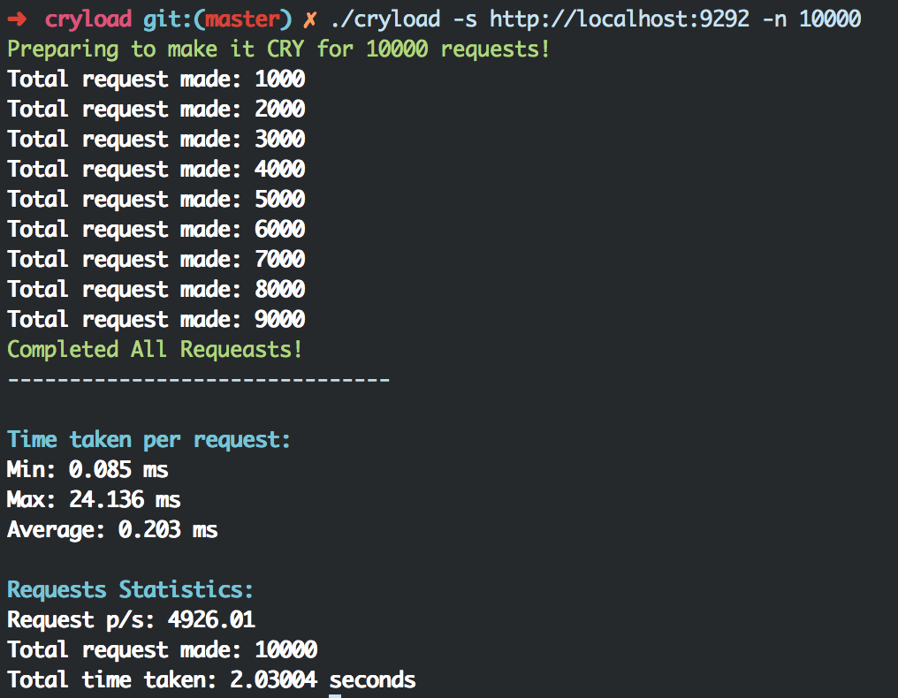

# cryload

HTTP benchmarking tool writen in [Crystal](http://crystal-lang.org/)

## Installation

### From Source

Cryload is tested on Crystal `0.9.1`

```
git clone https://github.com/Sdogruyol/cryload.git && cd cryload
crystal build src/cryload.cr --release
```

### OS X

```
brew tap sdogruyol/cryload
brew install cryload
```

## Usage
You can specify the number of requests after the url. The default request number is 1000.

```
./cryload -s http://wwww.localhost:9292 -n 10000
```




When running against an SSL\TLS enabled site, you have the option of using verification for the ssl certificate.  
By default the verification it turned off as most use cases will run against a local lab server.  
If you wish to turn it on, just use: `--tls` or `-t` with 'y' or 'n' for yes or no  

```
./cryload -s https://wwww.localhost:9292 -n 10000 --tls y

```

### Bash Completion

Run these commands to enable Bash Autocompletion

```
cryload --completion >> ~/.cryload.completion.sh
echo 'source ~/.cryload.completion.sh' >> .bash_profile
```

## Development

DONE:

1. Request number
2. Pretty output
3. Performance
4. Kill signal handling

TODO:

1. Multithreading

## Contributing

1. Fork it ( https://github.com/sdogruyol/cryload/fork )
2. Create your feature branch (git checkout -b my-new-feature)
3. Commit your changes (git commit -am 'Add some feature')
4. Push to the branch (git push origin my-new-feature)
5. Create a new Pull Request

## Contributors

- [Sdogruyol](https://github.com/sdogruyol) Sdogruyol - creator, maintainer
