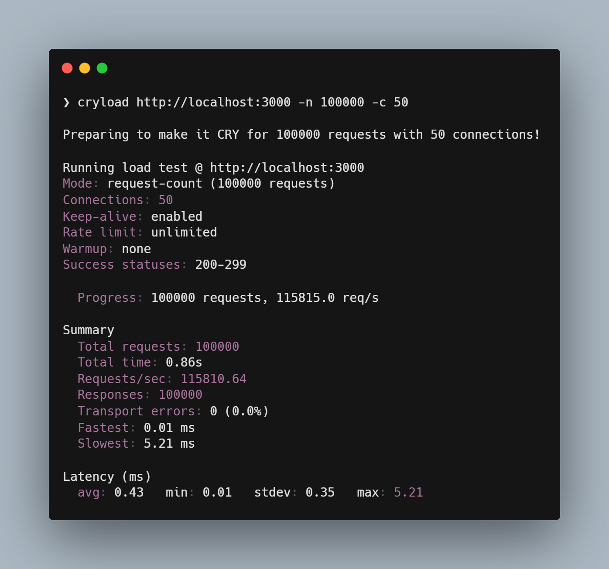

<p align="left">
  
</p>

# cryload - HTTP load testing for CI/CD

Cross-platform, single-binary HTTP load testing CLI. A modern alternative to `ab` / `wrk` / `hey`, written in Crystal.

[](https://github.com/sdogruyol/cryload)
[](https://github.com/sdogruyol/cryload/actions/workflows/ci.yml)
[](https://github.com/sdogruyol/cryload/releases)
[](https://github.com/sdogruyol/cryload/releases)

[](LICENSE)

---

## Quick start

```bash
curl -sSfL https://raw.githubusercontent.com/sdogruyol/cryload/master/scripts/install.sh | sh
cryload https://example.com -n 1000 -c 50
```

1000 requests, 50 concurrent connections, JSON/CSV/plain output. That's it.

<p align="center">
  
</p>

---

## Why cryload?

Existing tools work fine on your laptop. cryload is built for the one place that matters most: **CI/CD pipelines**.

| Problem | Solution |
|---------|----------|
| "Did my deploy break performance?" | Set latency thresholds that fail your build |
| "Where do I put the results?" | JSON and CSV output, ready to parse |
| "Different OS in CI vs local?" | Single binary for Linux, macOS, Windows |
| "Which tool works in all three?" | cryload does |

If you need a graph on your laptop, use wrk. If you need to **fail a pipeline when p99 goes over 200ms**, use cryload.

---

## Features

- ⚡ **Concurrent** load with configurable connection count
- ⏱️ **Duration** or **request count** mode
- 📊 **Latency percentiles**: p50, p75, p90, p95, p99, p999 + histogram
- 🎯 **CI thresholds**: `--max-p99`, `--max-fail-rate`, `--fail-on-error`
- 📦 **JSON / CSV / quiet** output for pipelines
- 🔒 **Rate limiting**, warmup, keep-alive, TLS skip
- 🌐 **Multi-URL**, redirects, custom success codes
- 🖥️ **Cross-platform**: Linux, macOS, Windows - single binary

---

## Performance

cryload is fast. Written in Crystal and compiled to native code.

| Test | Results |
|------|---------|
| **Localhost** (100 conn, 10s) | ~50,000 req/sec, p99 < 1ms |
| **Local nginx** (100 conn, 10s) | ~12,000 req/sec, p99 < 3ms |
| **Remote API** (50 conn, 30s) | ~2,000 req/sec, p99 < 80ms |
| **Binary size** | ~3 MB (single file, no dependencies) |
| **Memory per 10K requests** | ~15 MB |

No JVM, no Node. Just a single binary that starts instantly and uses almost no memory.

---

## Installation

### Option 1: Install script (recommended)

**Linux / macOS:**
```bash
curl -sSfL https://raw.githubusercontent.com/sdogruyol/cryload/master/scripts/install.sh | sh -s
```

**Windows (PowerShell):**
```powershell
iwr -useb https://raw.githubusercontent.com/sdogruyol/cryload/master/scripts/install.ps1 | iex
```

### Option 2: Prebuilt binary

Download from [Releases](https://github.com/sdogruyol/cryload/releases):
```bash
chmod +x cryload-linux
./cryload-linux --help
```

### Option 3: Build from source

Requires Crystal >= 1.19.0.
```bash
git clone https://github.com/sdogruyol/cryload.git && cd cryload
shards build --release
```

---

## Usage

```bash
cryload <url> [options]
```

| Option | Description |
|--------|-------------|
| `-n`, `--numbers` | Number of requests |
| `-d`, `--duration` | Test duration in seconds |
| `-c`, `--connections` | Concurrent connections (default: 10) |
| `-m`, `--method` | HTTP method (default: GET) |
| `-b`, `--body` | Request body |
| `--body-file` | Read body from file |
| `--body-stdin` | Read body from stdin |
| `-H`, `--header` | Repeatable header (`-H "Key: Value"`) |
| `-a`, `--basic-auth` | Basic auth (`user:password`) |
| `--timeout` | Connect/read timeout in seconds |
| `-q`, `--rate` | Rate limit (req/sec) |
| `-L`, `--follow-redirects` | Follow redirects |
| `--output-format` | `text`, `json`, `csv`, `quiet` |
| `--success-status` | Custom success codes/ranges |
| `--insecure` | Skip TLS verification |
| `--warmup` | Warmup seconds before benchmark |
| `--proxy` | HTTP(S) proxy |
| `--cookie` | Repeatable cookie (`name=value`) |
| `--urls-file` | Load target URLs from file |
| `--random-path` | Append random path per request |

### Common examples

```bash
# 10K requests, 100 concurrent
cryload http://localhost:3000 -n 10000 -c 100

# 30 seconds, 50 connections
cryload http://localhost:3000 -d 30 -c 50

# POST with JSON body
cryload http://localhost:3000/api -n 500 -m POST \
  -H "Content-Type: application/json" \
  -b '{"name":"cry"}' --timeout 5
```

See [docs/examples.md](docs/examples.md) for more.

---

## CI/CD

cryload is built for pipelines. Use `--json` or `--output-format csv` for structured output, `--output-format quiet` for exit-code-only checks.

| Flag | Effect |
|------|--------|
| `--fail-on-error` | Exit 1 on any HTTP/transport error |
| `--max-fail-rate 5` | Exit 1 if failure rate > 5% |
| `--max-p99 200` | Exit 1 if p99 > 200 ms |

### GitHub Actions example

```yaml
- name: Install cryload
  run: curl -sSfL https://raw.githubusercontent.com/sdogruyol/cryload/master/scripts/install.sh | sh -s

- name: Latency SLA
  run: |
    cryload http://localhost:3000/api -n 500 --max-p99 250 --json > result.json
    jq -e '.latency_ms.p99 <= 250' result.json
```

---

## How cryload compares

| Feature | cryload | ab | hey | wrk |
|---------|:-------:|:--:|:---:|:---:|
| **CI/CD output** (JSON/CSV/quiet) | ✅ | - | JSON | - |
| **CI threshold exit codes** | ✅ | - | - | - |
| **Rate limiting** (`--rate`) | ✅ | - | partial | - |
| **Cross-platform binary** | ✅ | Linux | ✅ | Linux |

---

## Built with Crystal

cryload is written in [Crystal](https://crystal-lang.org/). Ruby-like syntax, compiled speed, single-binary deployment.


---

## FAQ

**Why not just use ab / hey / wrk?**

Those tools are great for local benchmarks. cryload is built for CI/CD. JSON output, threshold exit codes, cross-platform binaries. If you want to fail a pipeline when p99 goes over 200ms, use cryload.

**Can I use cryload for DDoS?**

No. cryload is designed for testing your own servers and CI pipelines. Do not use it against targets you don't own.

**Does cryload support HTTP/2?**

Not yet. HTTP/1.1 only for now. HTTP/2 is on the roadmap.

**Is there a Docker image?**

Not yet. The single binary approach means you don't need Docker. Just download and run.

**Why is it written in Crystal?**

Crystal compiles to a single native binary with no runtime. It starts instantly, uses minimal memory, and delivers C-like performance with Ruby-like syntax.

## Sponsors

If cryload helps your CI pipeline, consider [sponsoring](https://github.com/sponsors/sdogruyol). Every dollar helps me keep building open source tools full time.

[](https://github.com/sponsors/sdogruyol)

---

## License

MIT